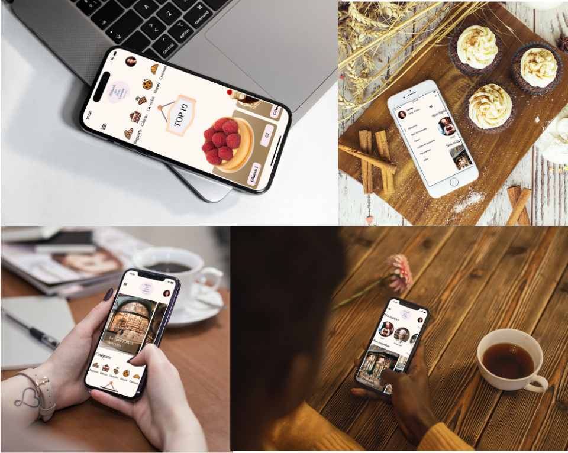

# ConfectioneryShop
Patisserie App in SwiftUI with side menu
# Short Description
🍰 About the Project

Welcome to the repository of our French patisserie app, written in SwiftUI! This project is a demo showcasing various baked goods and simulated purchasing options (Note: Payment function is not enabled, as this is a demonstration app).

🛠️ Technologies Used

SwiftUI: For crafting the user interface and user experience
🎨 Design Highlights

We focus on an elegant and appealing design that complements the scrumptious look of the showcased products. Colors and typography have been carefully selected to offer an immersive user experience.

📱 Interface

The app is optimized for iOS and employs an intuitive user interface for easy navigation and interaction.

💻 Local Installation

Clone the repository
bash
Copy code
git clone https://github.com/YourUsername/ProjectName.git
Open the project in Xcode and run the simulator

👇 If you like this project, don't forget to star it!

# GIF Demo

# Video
[Check out my YouTube video!](https://youtube.com/shorts/zYpi4Raabjc?feature=share)
